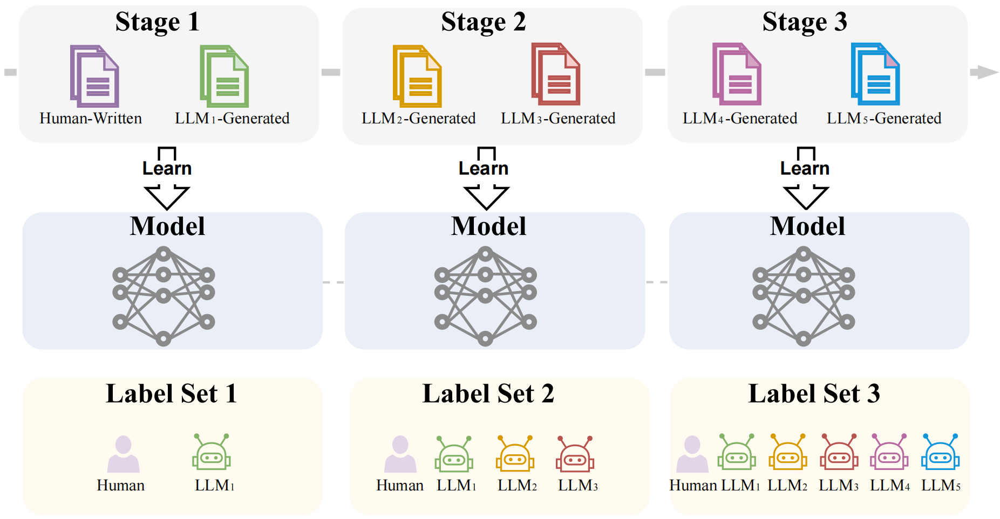
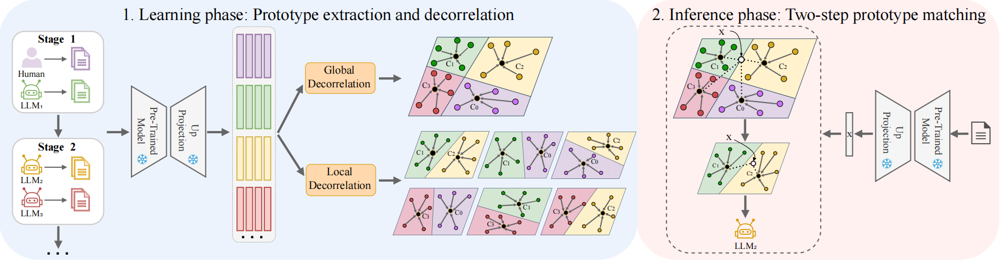

<div align="center">
  
  <div>
  <h1>Continual Origin Tracing of LLM-Generated Text</h1>
  </div>

  <div>
      Haoran Li*&emsp; Quan Wang*&emsp; 
  </div>
  <br/>

</div>

## Introduction
In this work, we introduce a new task called continual origin tracing of LLM-generated text. We frame origin tracing as a class-incremental learning problem: as new LLMs continuously emerge, the model must incrementally learn to identify each new one without forgetting previously seen LLMs. For this task, we further devise a novel approach for the continual origin tracing task, referred to as Global and Local Prototype Decorrelation (GLPD). GLPD is basically a prototype-based incremental learning method, where prototypes for new LLMs are continually extracted using a frozen pre-trained model, and origin tracing is performed by matching the input with those prototypes.

To facilitate future research and rigorously evaluate our method, we construct COT-Bench, a new benchmark for Continual Origin Tracing of LLM-generated text. COT-Bench contains data from 19 LLMs (released by 12 vendors) and human-written content, spanning eight diverse domains. The LLMs, along with their generated data, are ordered chronologically and divided into delineated learning stages, with human-written text always appearing in the first stage. This setup simulates the real-world scenario where new LLMs continuously emerge over time. We then evaluate the proposed method GLPD on this benchmark, making comparisons to a wide range of existing continual learning methods. The results show that GLPD consistently outperforms all baselines, often by large margins, across all 8 domains.

<p align="center">
  
</p>

<p align="center">
  
</p>

## Requirements
### 🗂️ Environment
* torch==2.0.1
* torchvision==0.15.2
* transformers==4.47.1
* other requirments please see `requirements.txt`

### 🔎 Dataset
COT-Bench covers eight diverse domains—Abstracts, Books, News, Poetry, Recipes, Reddit, Reviews, and Wikipedia. For each domain, it provides parallel text generated by 19 LLMs from 12 vendors, as well as human-written content. The included LLMs are:
* OpenAI: GPT-2, GPT-3, ChatGPT, GPT-4, GPT-4o
* Cohere: Cohere, CohereChat
* MPT: MPT, MPT-Chat
* LLaMA: LLaMA-Chat
* Mistral: Mistral, Mistral-Chat
* Gemini: Gemini-Pro
* GLM: GLM-4-Plus
* Spark: Spark-Max
* ERNIE: ERNIE-4.0-Turbo
* Doubao: Doubao-Pro
* Qwen: Qwen-Plus
* Deepseek: Deepseek-Chat

COT-Bench dataset download: Google Drive: [link](https://drive.google.com/drive/folders/195dNDYPBV_dTzelu_foxhDhbVPy6VH-U?usp=drive_link) or Hugging Face: [link](https://huggingface.co/datasets/sleep24/COT-bench/tree/main). After downloading the dataset, place it in the `./data/` directory.

## 🔑 Running scripts

Please follow the settings in the exps folder to prepare json files, and then run:
```
python main.py --config ./exps/[filename].json
```

If you want to run the Abstracts domain, you can follow the script: 
```
python main.py --config ./exps/abstracts.json
```

After running the code, you will get a log file in the `logs/glpd/abstracts/` folder.

## 👨‍🏫 Acknowledgment

This repo is heavily based on [PyCIL](https://github.com/G-U-N/PyCIL), many thanks.